<h1 align="center">🎬 Trakt Tracker</h1>
<p align="center">
  <strong>Self-hosted Trakt watch-history pipeline for InfluxDB analytics.</strong>
</p>

<p align="center">
  <a href="#features">Features</a> • 
  <a href="#how-it-works">How It Works</a> • 
  <a href="#quick-start">Quick Start</a> • 
  <a href="#configuration">Configuration</a> • 
  <a href="#project-structure">Project Structure</a> • 
  <a href="#troubleshooting">Troubleshooting</a>
</p>

<p align="center">
  
  
  
  
  
</p>

<br>

<p align="center">
  
  <br>

</p>

---

## Features

- **Backfill + Incremental** — Full initial import of your entire watch history, followed by overlap-based syncing.
- **Reconciliation** — Catches Trakt hard deletes and rewrites affected raw ranges to maintain accuracy.
- **Smart Deduplication** — Persistent SQLite state keyed by Trakt `history_id` ensures no duplicated events.
- **Daily Metrics** — Rebuilds `all`, `movie`, and `episode` daily aggregates automatically.
- **OAuth Bootstrap** — Supports device flow, auth code, or a pre-seeded refresh token.
- **Docker Ready** — Compose-friendly setup with distinct `/data` and `/config` volumes.
- **CLI Modes** — Run one-time jobs with `--once` or test without database writes using `--no-influx`.
- **Resilient Client** — Built-in retries, rate-limit handling, token rotation, and dead-letter queues.

---

## How It Works

Trakt Tracker extracts your movie and episode watch history from Trakt and stores it in InfluxDB, enabling you to build detailed dashboards of your viewing habits. It handles both full initial backfills and recurring incremental syncs.

### Architecture

```mermaid
flowchart LR
    subgraph Source
        T["🎬 Trakt API"]
    end

    subgraph Core Engine
        C["🔄 TraktClient"]
        E["⚙️ SyncEngine"]
        S[("🗄️ SQLite state.db")]
        A["📊 Daily Aggregator"]
        C --> E
        E <--> S
        S --> A
    end

    subgraph Destination
        R[("💾 Influx: trakt_raw")]
        G[("📈 Influx: trakt_agg")]
        E --> R
        A --> G
    end

    T --> C
    J["⏱️ Cron Scheduler"] --> E
```


### Sync Lifecycle

```mermaid
flowchart TD
    A["🚀 Start service"] --> B["📂 Load config & SQLite state"]
    B --> C{"Refresh token exists?"}
    
    C -- No --> D["🔑 Run OAuth bootstrap"]
    C -- Yes --> E["🔌 Create clients"]
    D --> E
    
    E --> F{"Backfill done?"}
    F -- No --> G["📥 Run one-time backfill"]
    F -- Yes --> H["⏭️ Skip backfill"]
    
    G --> I["⏳ Start scheduler"]
    H --> I

    I --> J["🔄 Incremental job"]
    J --> K["Fetch overlap window → Dedupe → Write raw → Rebuild daily"]
    K --> I

    I --> L["🧹 Reconcile job"]
    L --> M["Fetch rolling window → Handle hard deletes → Rebuild daily"]
    M --> I
```


---

## Quick Start

### 1. Prerequisites

- Docker Engine + Docker Compose v2
- Trakt API app (`client_id`, `client_secret`)
- InfluxDB 2.x (skip with `ENABLE_INFLUX=false`)

### 2. Configure Environment

```bash
cp .env.example .env
```

Minimum required `.env` values:

```dotenv
TRAKT_CLIENT_ID=your_client_id
TRAKT_CLIENT_SECRET=your_client_secret
INFLUX_URL=http://influxdb:8086
INFLUX_TOKEN=your_token
INFLUX_ORG=your_org

# Optional GHCR image:
IMAGE=ghcr.io/nichtlegacy/trakt-tracker:latest
```

### 3. Optional Runtime Config

```bash
mkdir -p config data
cp config.example.toml config/config.toml
```

### 4. Run OAuth Bootstrap Once

You must authenticate with Trakt before the service can run in the background.

```bash
docker compose run --rm trakt-tracker --auth
```

### 5. Start Service

```bash
docker compose up -d --build
docker compose logs -f trakt-tracker
```

<details>
<summary><strong>Local Installation (Python Setup)</strong></summary>

```bash
python -m venv .venv
source .venv/bin/activate
pip install --upgrade pip
pip install -e ".[dev]"

cp .env.example .env

trakt-tracker --auth
trakt-tracker
```

Windows PowerShell:
```powershell
.\.venv\Scripts\Activate.ps1
```

</details>

---

## Configuration

Settings are loaded in the following priority order:
1. Environment variables
2. `config.toml` (`CONFIG_PATH`)
3. Built-in defaults

Default config paths are `/config/config.toml` for Docker, and `./config.toml` locally.

<details>
<summary><strong>Environment Variables</strong></summary>

| Variable | Required | Default | Description |
|----------|----------|---------|-------------|
| `TRAKT_CLIENT_ID` | Yes | - | Trakt app client ID |
| `TRAKT_CLIENT_SECRET` | Yes | - | Trakt app client secret |
| `TRAKT_REFRESH_TOKEN` | No | - | Optional pre-seeded refresh token |
| `TRAKT_AUTH_CODE` | No | - | Optional one-time auth code |
| `ENABLE_INFLUX` | No | `true` | Disable writes with `false` |
| `INFLUX_URL` | If enabled | - | InfluxDB server URL |
| `INFLUX_TOKEN` | If enabled | - | InfluxDB write token |
| `INFLUX_ORG` | If enabled | - | InfluxDB organization |
| `INFLUX_BUCKET_RAW` | No | `trakt_raw` | Raw events bucket |
| `INFLUX_BUCKET_AGG` | No | `trakt_agg` | Daily aggregates bucket |
| `SYNC_CRON` | No | `0 6,18 * * *` | Incremental schedule |
| `RECONCILE_CRON` | No | `30 3 * * *` | Reconcile schedule |
| `TIMEZONE` | No | `Europe/Berlin` | IANA timezone |
| `OVERLAP_HOURS` | No | `24` | Incremental overlap window |
| `RECONCILE_DAYS` | No | `7` | Reconcile rolling window |
| `STATE_DB_PATH` | No | `./.data/state.db` | SQLite db (Docker: `/data/state.db`) |
| `LOG_LEVEL` | No | `INFO` | Runtime log level |
| `TRAKT_MAX_RETRIES` | No | `5` | Request retry count |
| `TRAKT_RETRY_AFTER_MARGIN`| No | `0.9` | Added seconds after 429 rate limit |
| `TRAKT_MIN_REQUEST_INTERVAL_SECONDS` | No | `0.0` | Optional client-side throttling |

</details>

### CLI Commands

The `trakt-tracker` executable provides several commands for manual intervention and testing.

#### 🔑 Setup & Authentication

Interactively guides you through the Trakt Device OAuth flow. This is required once before the background service can run.
```bash
trakt-tracker --auth
```

---

Non-interactive alternative if you already have a Trakt OAuth code.
```bash
trakt-tracker --auth-code "<code>"
```

#### 🔄 Manual Syncs

Manually triggers the initial backfill sync. Skips if the state database says it's already completed.
```bash
trakt-tracker --once backfill
```

---

Forces a full backfill regardless of local state. Redownloads all history from Trakt.
```bash
trakt-tracker --once backfill --force-backfill
```

---

Manually triggers the incremental sync (fetches only recent history since the last run).
```bash
trakt-tracker --once incremental
```

---

Manually triggers the reconcile sync (checks for Trakt hard deletes in a rolling window).
```bash
trakt-tracker --once reconcile
```

#### 🛠️ Testing & Troubleshooting

Tests the connection to your InfluxDB and verifies write permissions on the configured raw and aggregate buckets.
```bash
trakt-tracker --test-influx
```

---

Wipes the local SQLite state database. Use this if you want to completely start over. Note that you will need to re-authenticate with `--auth` afterwards.
```bash
trakt-tracker --reset-state
```

---

Runs syncs but skips writing metrics to InfluxDB. Useful for dry runs and testing API behaviors locally.
```bash
trakt-tracker --no-influx
```

---

## Data Model

**`watch_event` (Raw Bucket)**
- **Tags:** `media_type`, `source`, `is_rewatch`
- **Fields:** `history_id`, `trakt_id`, `runtime_min`, `title`, `ingested_at`, optional episode fields
- **Timestamp:** Original Trakt `watched_at` (UTC)

**`watch_daily` (Aggregate Bucket)**
- **Tags:** `media_type` (`all`, `movie`, `episode`)
- **Fields:** `events_count`, `unique_titles_count`, `watch_minutes_total`, `rewatch_events_count`, `first_watch_events_count`
- **Timestamp:** UTC day start

---

## Project Structure

```text
trakt-tracker/
├── src/trakt_tracker/
│   ├── main.py              # CLI entrypoint + scheduler setup
│   ├── auth.py              # OAuth bootstrap and token exchange
│   ├── trakt_client.py      # Trakt API client + retry logic
│   ├── sync_engine.py       # Backfill/incremental/reconcile workflows
│   ├── state_store.py       # SQLite state, dedupe, cursors, dead letters
│   ├── influx_writer.py     # Writes to InfluxDB
│   ├── aggregator.py        # Daily metrics builder
│   ├── config.py            # ENV/TOML loader
│   ├── models.py            # Event models
│   └── noop_influx_writer.py# Writer for dry runs
├── tests/                   # Unit tests
├── .github/workflows/       # CI pipelines
├── docker-compose.yml
├── Dockerfile
├── config.example.toml
├── .env.example
├── entrypoint.sh
└── pyproject.toml
```

---

## Troubleshooting

| Problem | Likely cause | Solution |
|---------|-------------|----------|
| `Missing required configuration value: TRAKT_CLIENT_ID` | Missing env/config | Set `TRAKT_CLIENT_ID` and `TRAKT_CLIENT_SECRET` in `.env` |
| `Missing required Influx configuration values` | Influx enabled but missing attributes | Set Influx vars or `ENABLE_INFLUX=false` |
| `Trakt refresh token is missing` | OAuth bootstrap not completed | Run `docker compose run --rm trakt-tracker --auth` |
| `Trakt token refresh failed with auth error` | Refresh token revoked/invalid | Re-run bootstrap and replace token |
| Startup fails on timezone | Invalid `TIMEZONE` | Use a valid IANA timezone (e.g., `UTC`, `Europe/Berlin`) |
| Reconcile skips hard deletes | Parse errors in reconcile window | Inspect `dead_letters` in `state.db`, fix, rerun reconcile |
| Frequent 429 warnings | Trakt rate limiting | Reduce sync frequency, tune retry/throttle settings |

---

## License

Distributed under the MIT License. See [LICENSE](LICENSE) for more information.
